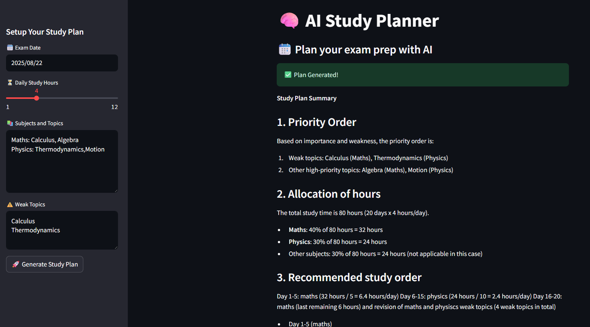

# 📚 AI Study Planner

An intelligent and intuitive AI-powered study planner web app that helps students prepare for upcoming exams by distributing study topics smartly over available days. The app generates personalized, prioritized study schedules with time allocation based on subject importance and weak topics, including daily study blocks with break recommendations.

---

## 🚀 Features

- 🔠 Input your exam date, daily study hours, subjects with topics, and weak topics.
- 🧠 AI-powered personalized study plan generation using Groq’s LLaMA 3.1 Instant model.
- 📜 Prioritizes weak topics by allocating them extra revision time.
- 🫧 Clear, structured daily study plans with recommended study and break blocks.
- 🗨️ Streamed plan output with animated text effect for engaging user experience.
- ⬇️ Download your study plan as a `.txt` file for offline access.

---

## ⚙️ Tech Stack

| Technology          | Purpose                                                |
|---------------------|--------------------------------------------------------|
| Python              | Core programming language                              |
| Streamlit           | Frontend Web App framework                             |
| Groq API (LLaMA 3.1)| AI model for creating personalized study plans         |
| dotenv              | Securely manage API keys                               |
| os                  | For environment handling                               |
| datetime            | For Calulating Dates                                   |
| Time                | For add text streaming animation                       | 

---

## 🚀 Getting Started

### 1. Clone the Repository

```bash
git clone https://github.com/KaisoX24/AI-Study-Planner.git
cd AI-Study-Planner
```
### 2. Install Dependencies
- It's recommended to use a virtual environment:

```bash
python -m venv venv
venv\Scripts\activate # For MAC: source venv/bin/activate
```
- Install the required packages:

```bash
pip install -r requirements.txt
```
### 3. Set Up .env
Create a .env file in the root directory and add your Groq API key:
```bash
GROQ_API_KEY=your_api_key_here
```

### 4. Run the App
```bash
streamlit run main.py
```
---

## 📸 UI Preview


---
## 🧑‍💻 Author
Developed by Pramit Acharjya
---
## 🪪 License
MIT License — free to use, modify, and distribute.
